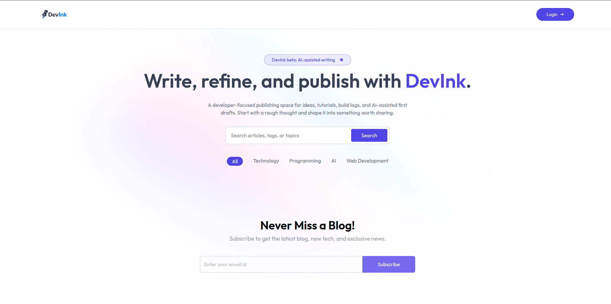
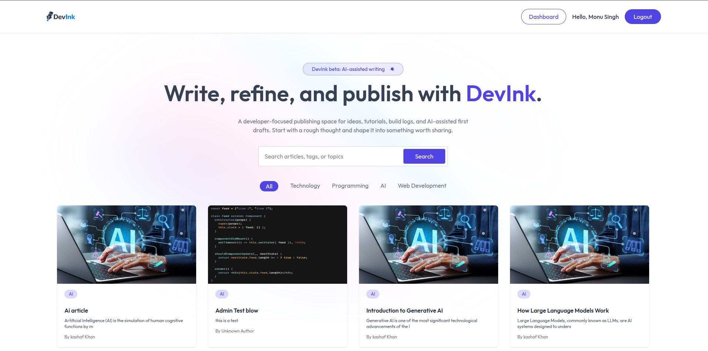
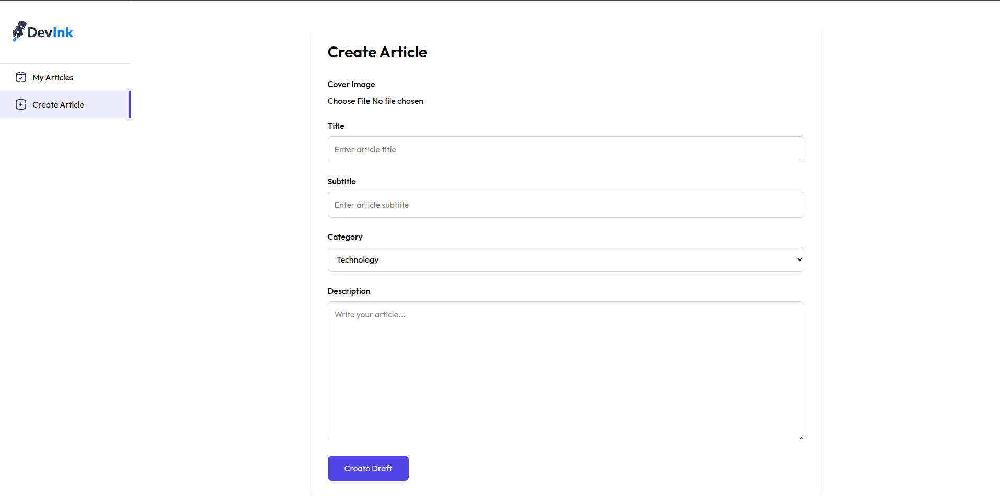
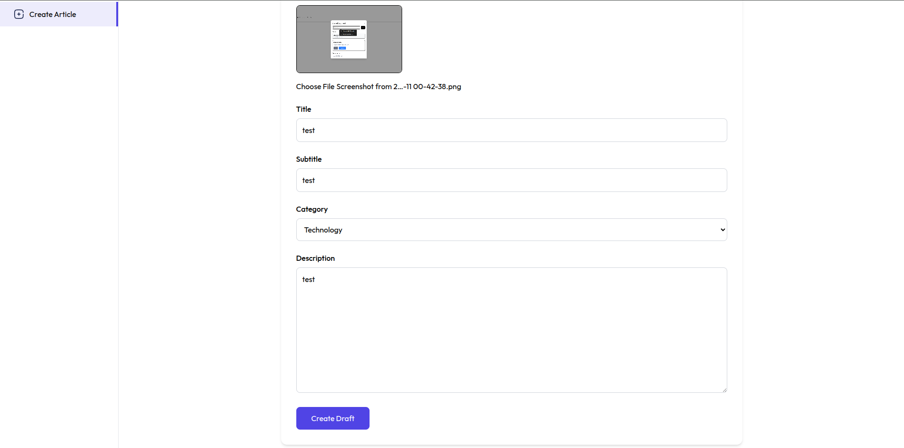
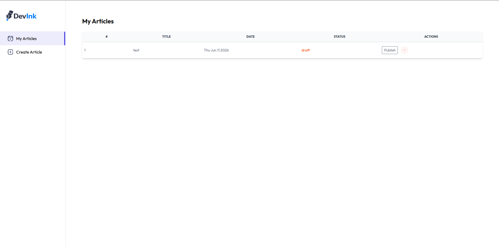

# DevInk

A developer-focused blogging platform built with the MERN stack that enables users to write, manage, and publish articles through a streamlined content creation workflow.

DevInk provides authentication, draft management, article publishing, category-based organization, search functionality, and AI-assisted writing support.

## Live Demo

Frontend: https://devink-xi.vercel.app

## Features

### Authentication & Authorization

* JWT Authentication
* Secure Login & Registration
* Protected Routes
* User Session Management

### Content Management

* Create Articles
* Save Drafts
* Publish Articles
* Delete Articles
* Manage Personal Content

### Discovery & Search

* Search Articles
* Browse by Category
* Filter Content
* Responsive Content Feed

### AI-Assisted Writing

* AI Writing Assistance
* Content Drafting Support
* Improved Writing Workflow

### Dashboard

* Article Management Dashboard
* Draft Tracking
* Publishing Workflow
* Author Controls

## Screenshots

### Homepage

Explore published content, search articles, and browse categories.

### Logged-In Experience

Personalized homepage with dashboard access and publishing controls.

### Create Article

Write and structure new articles with category selection and content management.

### Cover Image Preview

Preview uploaded cover images before publishing.

### Draft & Publishing Workflow

Manage drafts and publish articles directly from the dashboard.

## Tech Stack

### Frontend

* React
* React Router
* Bootstrap
* Axios

### Backend

* Node.js
* Express.js
* MongoDB Atlas
* Mongoose

### Authentication

* JWT
* bcrypt

### Storage

* Cloudinary (if used)
* Image Upload Support

## Project Structure

frontend/
server/
assets/

## Future Improvements

* Comments System
* User Profiles
* Bookmarks
* Newsletter Subscription
* Article Analytics
* Rich Text Editor

## Author

Paritosh Singh

Full Stack MERN Developer
